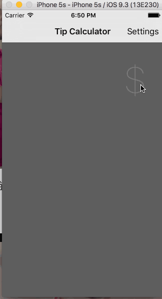

# Pre-work - *TipCalculator*

**TipCalculator** is a tip calculator application for iOS.

Submitted by: **Dinh Nguyen Minh Duc**

Time spent: **15** hours spent in total

## User Stories

The following **required** functionality is complete:

* [x] User can enter a bill amount, choose a tip percentage, and see the tip and total values.
* [x] Settings page to change the default tip percentage.

The following **optional** features are implemented:
* [x] Remember the bill amount across app restarts. After an extended period of time, clear the state. This is a UI trick that Apple uses with the Spotlight app. If you return there a minute later, it will show your most recent search. if you return 10 minutes later, it defaults to blank. To implement this, plug into the application lifecycle and track time using NSDate.
* [x] Use locale specific currency and currency thousands separator.
* [x] Add a light/dark color theme to the settings view. In viewWillAppear, update views with the correct theme colors.
* [x] Make sure the keyboard is always visible and the bill amount is always the first responder. This way the user doesn't have to tap anywhere to use this app. Just launch the app and start typing.
* [] Add animations to your UI
* [x] The Tip calculator has a very primitive UI. Feel free to play with colors, layout, or even modify the UI to improve it.

## Video Walkthrough 

Here's a walkthrough of implemented user stories:

GIF created with [LiceCap](http://www.cockos.com/licecap/).

## Notes

Describe any challenges encountered while building the app.

## License

    Copyright [yyyy] [name of copyright owner]

    Licensed under the Apache License, Version 2.0 (the "License");
    you may not use this file except in compliance with the License.
    You may obtain a copy of the License at

        http://www.apache.org/licenses/LICENSE-2.0

    Unless required by applicable law or agreed to in writing, software
    distributed under the License is distributed on an "AS IS" BASIS,
    WITHOUT WARRANTIES OR CONDITIONS OF ANY KIND, either express or implied.
    See the License for the specific language governing permissions and
    limitations under the License.
